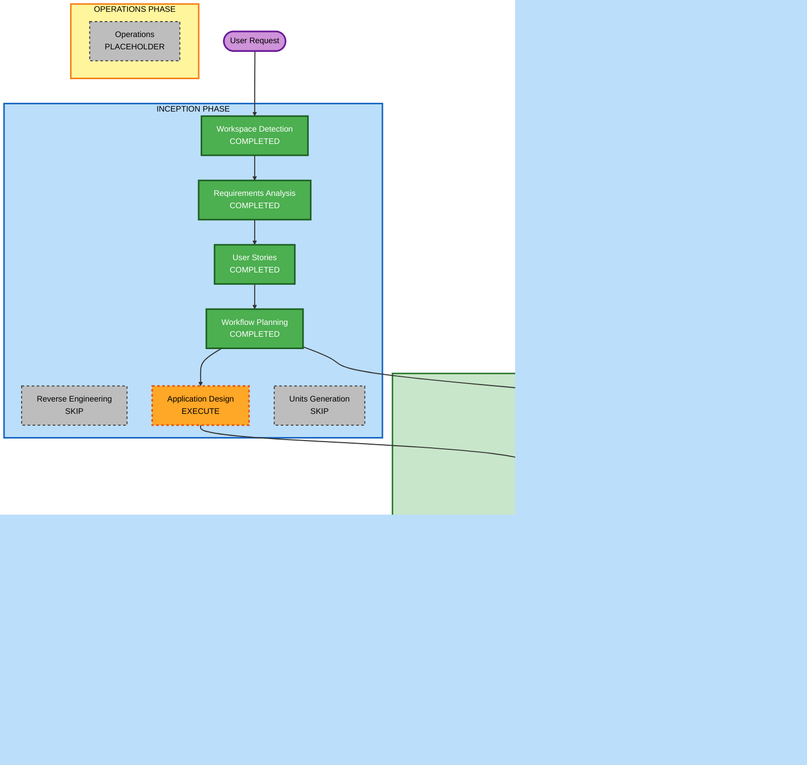

# Execution Plan

## Detailed Analysis Summary

### Transformation Scope
- **Transformation Type**: Greenfield Web Application
- **Primary Changes**: 画像アップロード UI、サーバー側判定 API、Gemini 連携、結果表示
- **Related Components**: フロントエンド画面、サーバー API、AI クライアント層、設定管理

### Change Impact Assessment
- **User-facing changes**: Yes - 単一ページの画像判定 UI を新規提供
- **Structural changes**: Yes - フロントエンドとサーバー API を分離した最小構成が必要
- **Data model changes**: No - 永続化データモデルは初期版では不要
- **API changes**: Yes - 画像を受け取り Gemini 判定結果を返す API が必要
- **NFR impact**: Yes - API キー保護、エラーハンドリング、ローカル実行性が重要

### Risk Assessment
- **Risk Level**: Medium
- **Rollback Complexity**: Easy
- **Testing Complexity**: Moderate

## Workflow Visualization



### Text Alternative
```text
INCEPTION:
- Workspace Detection: COMPLETED
- Reverse Engineering: SKIP
- Requirements Analysis: COMPLETED
- User Stories: COMPLETED
- Workflow Planning: COMPLETED
- Application Design: EXECUTE
- Units Generation: SKIP

CONSTRUCTION:
- Functional Design: SKIP
- NFR Requirements: EXECUTE
- NFR Design: EXECUTE
- Infrastructure Design: SKIP
- Code Planning: EXECUTE
- Code Generation: EXECUTE
- Build and Test: EXECUTE

OPERATIONS:
- Operations: PLACEHOLDER
```

## Phases to Execute

### 🔵 INCEPTION PHASE
- [x] Workspace Detection (COMPLETED)
- [x] Reverse Engineering (SKIPPED)
- [x] Requirements Elaboration (COMPLETED)
- [x] User Stories (COMPLETED)
- [x] Execution Plan (COMPLETED)
- [ ] Application Design - EXECUTE
  - **Rationale**: フロントエンド、サーバー API、Gemini 連携の責務分割を明確にする必要がある
- [ ] Units Generation - SKIP
  - **Rationale**: 初期版は単一アプリケーションとして扱え、複数ユニットへの分割効果が小さい

### 🟢 CONSTRUCTION PHASE
- [ ] Functional Design - SKIP
  - **Rationale**: 新規の複雑な業務データモデルはなく、後続の Application Design と Code Planning で十分整理できる
- [ ] NFR Requirements - EXECUTE
  - **Rationale**: API キー保護、AI API エラー処理、ローカル実行要件を明文化する必要がある
- [ ] NFR Design - EXECUTE
  - **Rationale**: セキュアなキー管理と責務分離を設計へ落とし込む必要がある
- [ ] Infrastructure Design - SKIP
  - **Rationale**: 初期リリースはローカル実行前提で、クラウド資源定義はまだ不要
- [ ] Code Planning - EXECUTE (ALWAYS)
  - **Rationale**: 実装順序と生成対象を明確にする
- [ ] Code Generation - EXECUTE (ALWAYS)
  - **Rationale**: Web アプリ本体とテスト実装が必要
- [ ] Build and Test - EXECUTE (ALWAYS)
  - **Rationale**: ローカル起動確認とテスト手順の整備が必要

### 🟡 OPERATIONS PHASE
- [ ] Operations - PLACEHOLDER
  - **Rationale**: 将来の展開フェーズ用

## Package Change Sequence
- Greenfield のため既存パッケージ更新シーケンスはなし

## Estimated Timeline
- **Total Phases**: 6
- **Estimated Duration**: 中程度

## Success Criteria
- **Primary Goal**: ユーザーが画像をアップロードし、犬らしさのパーセントと判定ラベルを確認できるローカル動作可能な Web アプリを実装する

## Extension Compliance Summary
- **No detected extensions**: N/A
