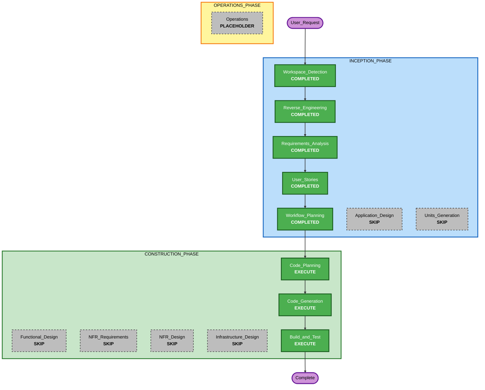

# Execution Plan

## Detailed Analysis Summary

### Transformation Scope (Brownfield Only)
- **Transformation Type**: Single component UI enhancement
- **Primary Changes**: `src/app/page.tsx` と `src/app/globals.css` を中心に、トップページのアップロード体験、状態表示、結果表示を改善する
- **Related Components**:
  - `src/app/page.tsx`
  - `src/app/globals.css`
  - `tests/page.test.tsx`
  - 必要に応じて `src/app/layout.tsx`

### Change Impact Assessment
- **User-facing changes**: Yes - アップロード導線、視覚印象、結果表示、エラーとローディングの見え方を直接変更する
- **Structural changes**: No - 既存の Next.js、Route Handler、Gemini 連携構造は維持する
- **Data model changes**: No - データ構造や永続化は変更しない
- **API changes**: No - `/api/analyze` の契約は維持する
- **NFR impact**: Yes - UX、アクセシビリティ、回帰テスト範囲に影響する

### Component Relationships (Brownfield Only)
- **Primary Component**: `src/app/page.tsx`
- **Infrastructure Components**: なし
- **Shared Components**: `src/types/analysis.ts`
- **Dependent Components**: `tests/page.test.tsx`
- **Supporting Components**: `src/app/globals.css`, `src/app/layout.tsx`

### Risk Assessment
- **Risk Level**: Medium
- **Rollback Complexity**: Easy
- **Testing Complexity**: Moderate

## Workflow Visualization

### Text Alternative
- Workspace Detection: COMPLETED
- Reverse Engineering: COMPLETED
- Requirements Analysis: COMPLETED
- User Stories: COMPLETED
- Workflow Planning: COMPLETED
- Application Design: SKIP
- Units Generation: SKIP
- Functional Design: SKIP
- NFR Requirements: SKIP
- NFR Design: SKIP
- Infrastructure Design: SKIP
- Code Planning: EXECUTE
- Code Generation: EXECUTE
- Build and Test: EXECUTE

## Phases to Execute

### 🔵 INCEPTION PHASE
- [x] Workspace Detection (COMPLETED)
- [x] Reverse Engineering (COMPLETED)
- [x] Requirements Elaboration (COMPLETED)
- [x] User Stories (COMPLETED)
- [x] Execution Plan (IN PROGRESS)
- [ ] Application Design - SKIP
  - **Rationale**: 新規コンポーネントやサービス設計は不要で、変更は既存トップページの境界内に収まる
- [ ] Units Planning - SKIP
  - **Rationale**: 単一コンポーネント中心の変更で、分割による効果が低い
- [ ] Units Generation - SKIP
  - **Rationale**: 実装単位を分けるほどの複雑さがない

### 🟢 CONSTRUCTION PHASE
- [ ] Functional Design - SKIP
  - **Rationale**: 新規ドメインロジックや複雑な業務ルールがない
- [ ] NFR Requirements - SKIP
  - **Rationale**: NFR は既存成果物で十分に定義済みで、今回の変更はそれらの UI 反映が中心
- [ ] NFR Design - SKIP
  - **Rationale**: 既存のローディング、再試行、アクセシビリティ方針を再利用できる
- [ ] Infrastructure Design - SKIP
  - **Rationale**: インフラやデプロイ構成の変更がない
- [ ] Code Planning - EXECUTE (ALWAYS)
  - **Rationale**: UI 改善の実装順序、テスト追加、責務分割の要否を整理する必要がある
- [ ] Code Generation - EXECUTE (ALWAYS)
  - **Rationale**: トップページ UI、スタイル、テストを実装更新する
- [ ] Build and Test - EXECUTE (ALWAYS)
  - **Rationale**: UI 回帰を含めた検証が必要

### 🟡 OPERATIONS PHASE
- [ ] Operations - PLACEHOLDER
  - **Rationale**: 今回の変更対象外

## Package Change Sequence (Brownfield Only)
- 1. `src/app/page.tsx` の UI 体験を改善する
- 2. `src/app/globals.css` で新しいビジュアルとレスポンシブスタイルを実装する
- 3. `tests/page.test.tsx` を拡張してプレビュー、状態表示、結果導線の回帰を確認する
- 4. 必要に応じて `src/app/layout.tsx` のメタデータを調整する

## Estimated Timeline
- **Total Phases**: 3
- **Estimated Duration**: 同一セッション内で実装と検証まで進行可能

## Success Criteria
- **Primary Goal**: MVP 感の強いトップページを、見た目と体験の両面で改善する
- **Key Deliverables**:
  - 画像プレビュー付きドラッグアンドドロップ UI
  - 視覚的に強化された結果表示
  - 改善後 UI を支えるテスト更新
- **Quality Gates**:
  - モバイルとデスクトップで破綻しない
  - 既存 API 契約を壊さない
  - テストで主要 UI 状態を確認できる

## Extension Compliance Summary
- **No detected extensions**: N/A
