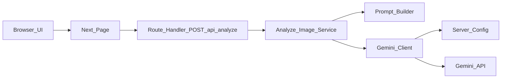
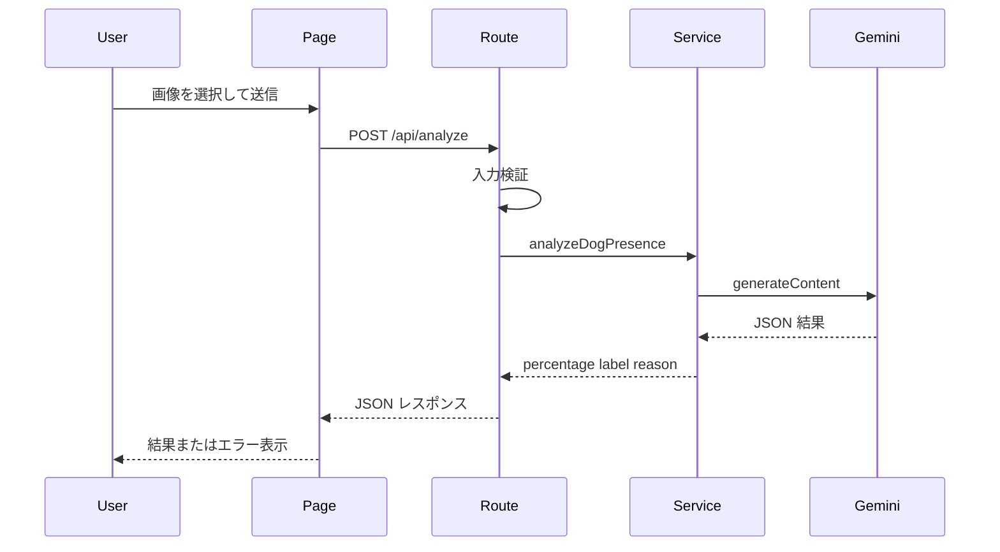

# System Architecture

## System Overview
本システムは Next.js を用いた単一アプリケーションで、クライアント UI とサーバー API を同居させています。利用者はトップページから画像をアップロードし、サーバー側 Route Handler が Gemini API を呼び出して犬らしさのパーセント、ラベル、理由を返します。

## Architecture Diagram

### Text Alternative
- ブラウザ UI は `src/app/page.tsx` に集約されている
- 送信先は `src/app/api/analyze/route.ts`
- Route Handler は `src/lib/analyze-image.ts` を呼ぶ
- サービス層は `src/lib/prompt.ts` と `src/lib/gemini-client.ts` に依存する
- Gemini Client は `src/lib/config.ts` から API キーとモデル名を取得する

## Component Descriptions

### `src/app/page.tsx`
- **Purpose**: UI 全体の画面ロジックを担う
- **Responsibilities**: ファイル入力、送信、ローディング表示、結果表示、エラー表示
- **Dependencies**: `fetch`, `AnalysisResponse`
- **Type**: Application

### `src/app/api/analyze/route.ts`
- **Purpose**: 画像解析 API のエントリポイント
- **Responsibilities**: フォームデータ読込、入力検証、サービス呼び出し、HTTP レスポンス返却
- **Dependencies**: `NextResponse`, `@/lib/analyze-image`
- **Type**: Application

### `src/lib/analyze-image.ts`
- **Purpose**: モデル応答の正規化と判定オーケストレーション
- **Responsibilities**: ラベル変換、数値補正、JSON 応答処理、エラー文言正規化
- **Dependencies**: `@/lib/prompt`, `@/lib/gemini-client`, `@/types/analysis`
- **Type**: Shared

### `src/lib/gemini-client.ts`
- **Purpose**: Gemini API との HTTP 通信を行う
- **Responsibilities**: エンドポイント生成、リクエスト送信、エラー判定
- **Dependencies**: `@/lib/config`, `@/types/analysis`
- **Type**: Client

### `src/lib/config.ts`
- **Purpose**: 環境設定の取得
- **Responsibilities**: 必須環境変数の検証、デフォルトモデル提供
- **Dependencies**: `process.env`
- **Type**: Shared

## Data Flow

### Text Alternative
1. 利用者が画像を選択して送信する
2. ページが `POST /api/analyze` を呼ぶ
3. Route Handler がファイル形式とサイズを検証する
4. サービスが Gemini API を呼び、JSON を正規化する
5. ページが結果またはエラーを表示する

## Integration Points
- **External APIs**: Gemini API。画像判定結果を生成するために使用
- **Databases**: なし
- **Third-party Services**: Google Generative Language API

## Infrastructure Components
- **CDK Stacks**: なし
- **Deployment Model**: ローカル実行前提の Next.js アプリ
- **Networking**: ブラウザから同一アプリの Route Handler を呼び、サーバー側から外部 HTTPS API に接続
