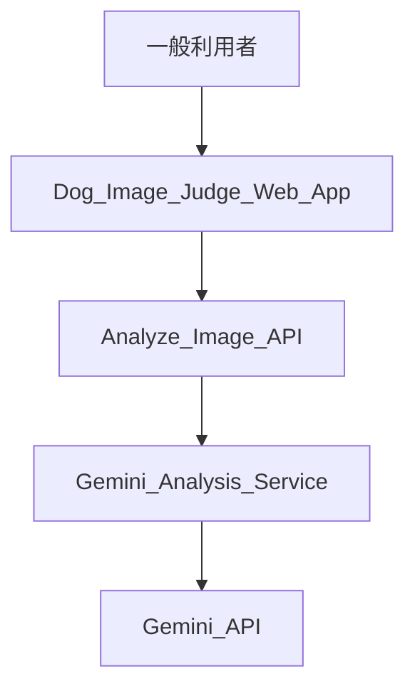

# Business Overview

## Business Context Diagram

### Text Alternative
- 一般利用者が Web アプリで画像を送信する
- Web アプリが `/api/analyze` を呼び出す
- API が Gemini 連携サービスを経由して Gemini API に判定を依頼する

## Business Description
- **Business Description**: 画像を 1 枚受け取り、その画像にどの程度犬が写っているかを即時に推定して返す単一用途の Web アプリケーション。
- **Business Transactions**:
  - 画像を選択する
  - 犬判定を依頼する
  - 判定中ステータスを確認する
  - パーセント、ラベル、理由を確認する
  - エラー発生時に再試行する
- **Business Dictionary**:
  - **犬らしさ**: 画像に含まれる犬要素の度合いを 0 から 100 で表した値
  - **判定ラベル**: `犬`、`犬っぽい`、`犬ではない` の 3 区分
  - **判定理由**: モデルが返した簡潔な説明文

## Component Level Business Descriptions

### Upload Page
- **Purpose**: 利用者が画像を選び、判定開始と結果確認を行う入口を提供する
- **Responsibilities**: 入力受付、送信制御、ステータス表示、結果表示、エラー表示

### Analyze Image API
- **Purpose**: ブラウザから受け取った画像を安全に検証し、判定処理へ受け渡す
- **Responsibilities**: MIME type 検証、サイズ上限検証、レスポンス整形

### Gemini Analysis Service
- **Purpose**: 画像判定業務ルールを Gemini に適用し、画面表示に使える形へ正規化する
- **Responsibilities**: プロンプト生成、Gemini 呼び出し、JSON 解析、値の丸め

### Configuration
- **Purpose**: サーバー側設定を取得し、秘密情報の露出を防ぐ
- **Responsibilities**: 環境変数取得、既定モデル設定

### Test Suite
- **Purpose**: MVP として必要な基本動作を検証する
- **Responsibilities**: 画面初期表示、ファイル選択、API 応答、レスポンス正規化の確認
