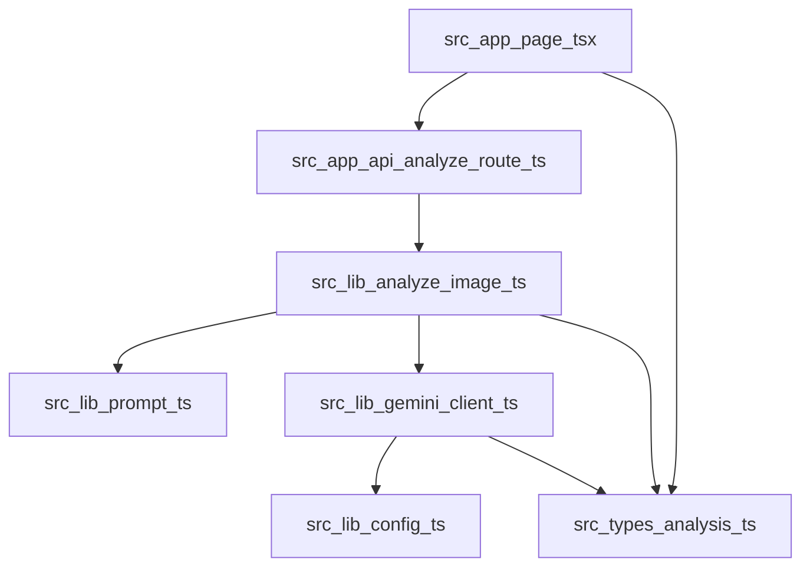

# Code Structure

## Build System
- **Type**: npm
- **Configuration**:
  - `package.json`: Next.js / Vitest / TypeScript のスクリプト定義
  - `tsconfig.json`: TypeScript 設定
  - `next.config.ts`: `reactStrictMode` 有効
  - `vitest.config.ts`: `@` エイリアスと jsdom 環境

## Key Modules

### Text Alternative
- UI は `src/app/page.tsx` にまとまっている
- サーバー処理は `src/app/api/analyze/route.ts` から `src/lib/*` に委譲される
- 型定義は `src/types/analysis.ts` に集約されている

### Existing Files Inventory
- `src/app/page.tsx` - トップページ UI と送信フロー
- `src/app/layout.tsx` - ルートレイアウトとメタデータ
- `src/app/globals.css` - 全体スタイル
- `src/app/api/analyze/route.ts` - 画像解析 API
- `src/lib/analyze-image.ts` - 判定ロジックの正規化とオーケストレーション
- `src/lib/gemini-client.ts` - Gemini API クライアント
- `src/lib/config.ts` - 環境変数取得
- `src/lib/prompt.ts` - システムプロンプト生成
- `src/types/analysis.ts` - API と UI で共有する型
- `tests/page.test.tsx` - ページの基本 UI テスト
- `tests/api-analyze.test.ts` - Route Handler の正常系テスト
- `tests/analyze-image.test.ts` - 正規化処理の単体テスト

## Design Patterns

### Thin Route Handler
- **Location**: `src/app/api/analyze/route.ts`
- **Purpose**: HTTP 入出力と業務処理を分離する
- **Implementation**: バリデーション後に `analyzeDogPresence` を呼ぶ

### Service and Client Separation
- **Location**: `src/lib/analyze-image.ts`, `src/lib/gemini-client.ts`
- **Purpose**: ビジネスルールと外部 API 通信を分離する
- **Implementation**: サービス層がクライアント層をラップする

### Shared Type Contract
- **Location**: `src/types/analysis.ts`
- **Purpose**: UI と API のレスポンス構造を一致させる
- **Implementation**: `AnalysisResponse` を共通利用する

## Critical Dependencies

### Next.js
- **Version**: `16.0.10` declared
- **Usage**: App Router、Route Handler、SSR 基盤
- **Purpose**: UI と API を単一アプリで提供する

### React
- **Version**: `19.2.0` declared
- **Usage**: クライアント画面の状態管理と描画
- **Purpose**: インタラクティブ UI の構築

### Vitest
- **Version**: `3.0.8`
- **Usage**: 単体テストとコンポーネントテスト
- **Purpose**: 基本回帰の自動検証
