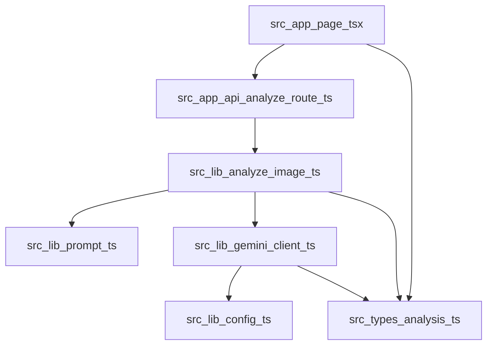

# Dependencies

## Internal Dependencies

### Text Alternative
- `src/app/page.tsx` は `AnalysisResponse` 型に依存する
- `src/app/api/analyze/route.ts` は `src/lib/analyze-image.ts` に依存する
- `src/lib/analyze-image.ts` は `prompt`, `gemini-client`, `types` に依存する
- `src/lib/gemini-client.ts` は `config`, `types` に依存する

### `src/app/api/analyze/route.ts` depends on `src/lib/analyze-image.ts`
- **Type**: Runtime
- **Reason**: 画像判定業務処理を委譲するため

### `src/lib/analyze-image.ts` depends on `src/lib/gemini-client.ts`
- **Type**: Runtime
- **Reason**: Gemini API 呼び出しを実行するため

### `src/lib/analyze-image.ts` depends on `src/lib/prompt.ts`
- **Type**: Runtime
- **Reason**: モデルへの業務ルール指示を生成するため

### `src/lib/gemini-client.ts` depends on `src/lib/config.ts`
- **Type**: Runtime
- **Reason**: API キーとモデル名を取得するため

## External Dependencies

### Next.js
- **Version**: `16.0.10` declared
- **Purpose**: Web UI と API 実装
- **License**: 未確認

### React
- **Version**: `19.2.0` declared
- **Purpose**: UI 構築
- **License**: 未確認

### React DOM
- **Version**: `19.2.0` declared
- **Purpose**: ブラウザ描画
- **License**: 未確認

### Vitest
- **Version**: `3.0.8`
- **Purpose**: テスト実行
- **License**: 未確認
